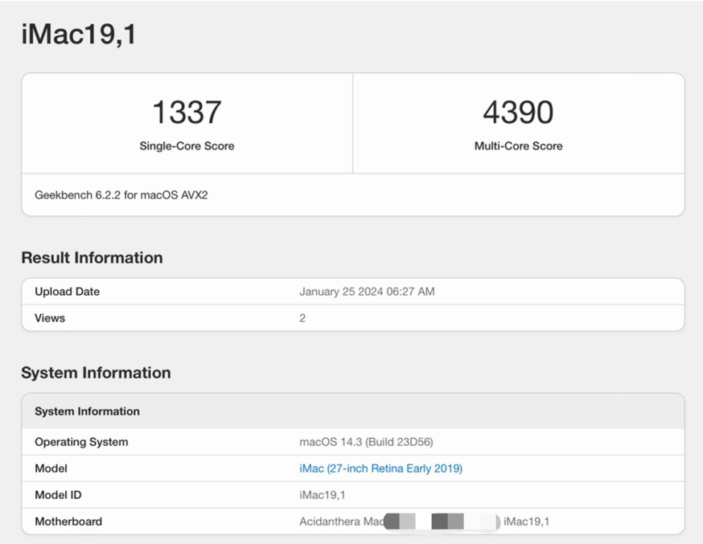

# Intel-NUC9-i7-9850H-macOS

https://github.com/0xHJK/Intel-NUC9-i7-9850H-macOS

Intel 英特尔 NUC9 幽灵峡谷 Hackintosh 黑苹果配置和教程，根据需求选择EFI

已测试机型：

- NUC9V7QNX i7-9850H

支持系统：

- macOS Sonoma 14.3 （OpenCore 0.9.7）

## 配置信息和可用性

- ✅ 型号：Intel NUC9V7QNX 幽灵峡谷
- ✅ 主板：Intel CM246 芯片组
- ✅ CPU：Intel i7-9850H
- ✅ 显卡：Intel UHD Graphics 630 核显
- ✅ 内存：联想 DDR4 16G 2667Mhz
- ✅ 以太网卡：Intel Ethernet Connection i219-LM and i210-AT（主板自带）
- ✅ 无线网卡：Intel Wi-Fi 6 AX200 (Gig+)
- ✅ 存储：西数黑盘 WD_BLACK SN770 2TB https://u.jd.com/cbv5dkE
- ✅ 显示器：
    - DELL U2720QM 4K
    - Redmi 27 NU 4K https://u.jd.com/cbv5dkE
    - 红米这款4K显示器显示效果还是不错的，价格不到戴尔的一半，但是能有戴尔90%的体验。
- ✅ USB接口正常
- ✅ SD读卡器接口正常
- ✅ 蓝牙正常
- ✅ 音频正常
- ✅ iCloud、AppStore等服务正常
- ⚠️ 没安装独立显卡，理论上 AMD 的免驱显卡应该支持
- ⚠️ 没测试 NUC9 系列其他型号，理论上应该支持
- ❌ Airdrop 不可用，需要另外购买网卡
- ❌ 用蓝牙耳机播放 Apple Music 时，只能下载播放，无法使用流媒体播放，需要另外购买网卡（用有线耳机或其他音乐播放器不影响）
    - https://www.tonymacx86.com/threads/apple-music-wont-stream-songs.319563/
- ❌ 无法显示风扇传感器信息，不影响使用（如果有朋友解决了可以告诉我一下）

## 安装说明

本次系统安装的当前最新版本 macOS Sonoma 14.3（2024年1月发布），最新的 OpenCore 0.9.7。安装步骤遵循官方指导文件，选择最小化最适合的配置，所有kexts 均从官方下载最新版，无多余内容。制作镜像和启动的教程很多，这里就不再赘述了，也可以看下面的参考链接。

注意事项：

- BIOS 设置中需关闭安全启动（Secure Boot Mode）。
- EFI 中的序列号信息建议用 hackintool 或者 GenSMBIOS 重新生成。
- 黑苹果的休眠功能偶尔有问题，建议在系统里关闭休眠。

```
sudo pmset autopoweroff 0
sudo pmset powernap 0
sudo pmset standby 0
sudo pmset proximitywake 0
sudo pmset tcpkeepalive 0
```

## 参考资料

- 官方文档：https://dortania.github.io/getting-started/
- 公众号：黑星实验室
- QQ群
    - 黑苹果一群：980197002（已满）
    - 黑苹果二群：1036366410（已满）
    - 黑苹果三群：915047338
- XPS 13 传送门：https://github.com/0xHJK/XPS13-9360-i5-8250U-macOS
- 华硕 Z370-F 传送门：https://github.com/0xHJK/ASUS-Z370-F-i7-8700K-macOS

## 跑分情况


AX200 网卡支持 Wi-Fi 160Mhz 的频段带宽，协商速率能达到 1732Mbps，能跑满家里的千兆带宽，还是不错的。


经实际测试，**最适合的 NUC9 的仿冒型号是 Macmini8,1**，如果是其他型号（如iMac）可能会对性能和可用性造成一定影响。设置型号为 iMac 时 CPU 分数只有 4400 分左右，但是设置型号为 Macmini 时 CPU 分数能达到 5000 分左右，**有超过 10% 的差距**。5000 分左右比较符合 i7-9850H 这个 CPU 的实际情况.




西数这块黑盘算是民用旗舰产品，标称速率能到5000M以上，可能是因为 NUC 本身 PCIE 接口问题，实测在 2000M 左右，当然也足够用了。如果要买 SSD 的话，其实买 PCIE 3.0 版本的其实也够用了。


## 捐赠支持

https://hjk.im/donate